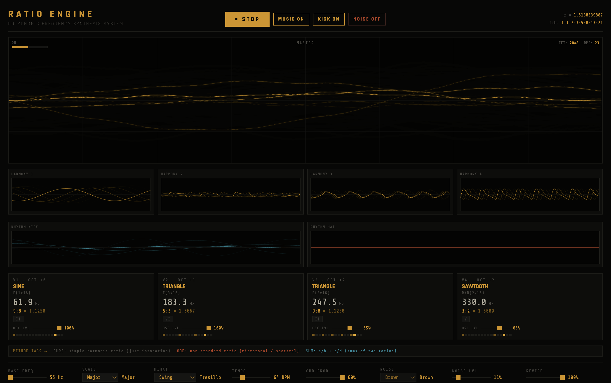

# Ratio Engine (Musical Doodle)

Interactive math-inspired synthesis experiments in Web Audio + Python.

## Showcase



## What this project includes

- Browser synth playground: `index.html`
- Standalone Python generator: `scripts/ratio_rhythm_music.py`

## Browser synth highlights

- 4 harmony oscillators with per-oscillator level controls
- Master + 6 analysis scopes (4 harmony, kick, hi-hat)
- Brown/white/pink noise with level and ON/OFF control
- Music ON/OFF and Noise ON/OFF toggles
- Focus Mode layout toggle with Pomodoro, quick todo, and quick notes
- Mood Presets templates (Night Drive, Deep Focus, Warm Bloom, Aurora Mist)
- Shortcut keys: `M` = music toggle, `K` = kick toggle, `N` = noise toggle, `F` = focus mode
- Auto hi-hat pattern switching every 8 bars
- Persistent UI settings via `localStorage`

## Focus Mode

Use the `FOCUS ON/OFF` button in the header (or press `F`) to switch between the full synth workspace and a distraction-reduced focus layout.

Focus Mode includes:

- Pomodoro timer with start/pause/reset and adjustable session length (5-60 min)
- Start/end timer sounds from `assets/timer-start.mp3` and `assets/timer-end.mp3`
- Click timer text to type minutes directly (validated to 5-60 with inline errors)
- Quick todo capture (`Enter` or `ADD`) with checkbox completion state
- Quick notes panel for session scratch notes

Focus mode state, timer state, todos, and notes are persisted to `localStorage`.

### Timer behavior notes (current)

- Pressing `START` plays `assets/timer-start.mp3`.
- Hitting `00:00` plays `assets/timer-end.mp3`.
- While running, touching/dragging the slider pauses the timer so adjustments do not auto-restart playback.
- Timer text opens a direct minute editor with a single `SET` action (input width `6rem`).

## Mood Presets

Use the `MOOD PRESET` selector in the control row to instantly apply a full template for composition and mix behavior.

- `Night Drive`: faster, darker, punchier.
- `Deep Focus`: minimal, low-noise, steady.
- `Warm Bloom`: softer and more spacious.
- `Aurora Mist`: airy, slow, ambient.
- `Custom`: active when you manually tweak controls after loading a preset.

Preset choice and all related settings are persisted to `localStorage`.

## Quick start

### Run browser synth

```bash
python3 -m http.server 8000
```

Then open `http://localhost:8000/index.html`.

### Python setup

```bash
python3 -m venv .venv
source .venv/bin/activate
pip install numpy scipy
```

### Generate audio (Python)

```bash
python3 scripts/ratio_rhythm_music.py --seed 42 --duration 30 --bpm 96 --output ratio_rhythm_music.wav
```

## TODO

- Improve typography
- Adjust colors to match standard contrast while keeping aesthetics
- Option to randomize kick pattern
- Option to mute kick or add kick level slider
- Focus todo: play a dedicated sound when a task is added
- Focus todo: add delete option for existing tasks
